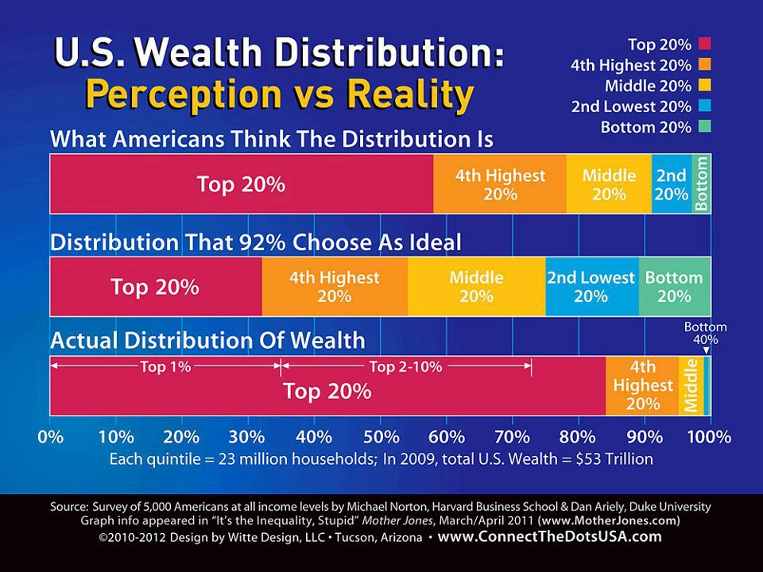
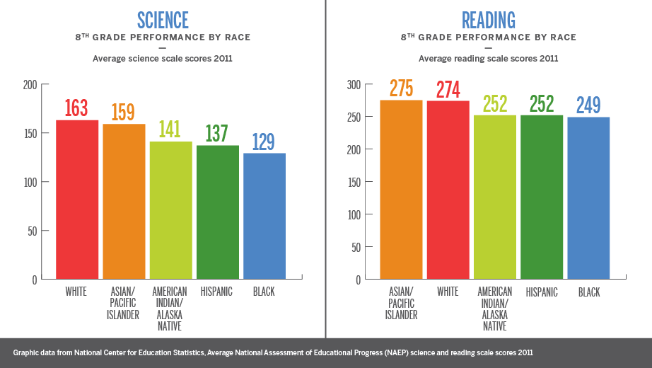

Title:  Why Do We Call It Capitalism?

Tags:   democracy, property, society, value creation

Timestamp: 20210311015311

Status: 9 - Published

Type:   blog

Featured: false

Greatest Hits: true

Category: 03 - Canonical

Importance: 10

Date:   16 Apr 2020

Index:  capitalism; inequality; 

Minutes to Read: 7

Image Alt: Multi-armed capitalism with his fingers in all the pies

Short ID: wdcic

Teaser:

As Americans we generally believe in capitalism as a superior economic system, and are typically convinced that our country is run on capitalistic principles. But I've been wondering lately: If these things are really true, then why do so few Americans actually possess any capital?  

Body:

As Americans we generally believe in [capitalism][] as a superior economic system, and are typically convinced that our country is run on capitalistic principles. 

But I've been wondering lately: If these things are really true, then why do [so few Americans actually possess any capital][ineq]? 

If we really believe that the means of production should be owned by ordinary citizens, and not by our government, then why is it that [the bulk of our country's capital is owned by so few of us][nyt]?

It makes for an odd picture: it's as if we were all strongly convinced of our right to gamble, and were all living in Las Vegas, and every one of us going out to the casinos every night after work -- but only a few of us being given any chips. Instead we seem to spend our free time on Facebook, telling each other how wonderful it is to live in a country where we all have the right to gamble -- and then being forced to earn a living by cleaning the ashtrays. 

Of course, one of the wonderful things about capitalism is that it's supposed to be an economic meritocracy, in which everyone gets to compete in free and open markets, and the cream is allowed to rise to the top, in terms of the best products and services and companies and workers. 

But, again, I've been wondering lately: if we believe so strongly in fair competition, then why don't all of our citizens get equal starts in life? Again, it makes for an odd picture: it's like going to the horse races only to see a few large and noble steeds competing against some old mares and broken-down drays that have been hauling the milk trucks. Of course it makes it all the more exciting when there's a surprise upset, when [some lowly newcomer beats the odds][shelby]... but wouldn't it be more in line with capitalist principles if [everyone got a fair start](https://news.harvard.edu/gazette/story/2016/02/the-costs-of-inequality-educations-the-one-key-that-rules-them-all/)?

And, once more, I've been struck by another question: if we believe so strongly in competition, then why are there [so few competitors][cap-myth]? Why are so many of our markets dominated by near-monopolies, or small oligopolies, in which a few large companies  divvy up a large and profitable market between themselves? And then, to go a step further -- why are so many of the *markets themselves* owned by large monopolies generating huge profits for a few owners? For, if truth be told, Amazon is little more than a marketplace for products, and Facebook is nothing but a marketplace for ideas and news, and Comcast is a marketplace for network packets. Again, it's an odd image: it's as if there were only two teams in the NFL, and the only game being played was the Super Bowl, and the two teams just took turns winning every year. I'm not sure many fans would consider that sort of an arrangement to be much of a competition. 

And so, if what we have is not really capitalism at all, or is, at best, a very odd and lopsided and perhaps even downright ugly sort of capitalism, then what is it exactly that we Americans *do* have? 

If we're to call it fairly what it is, I think we would describe it as a nationalized system of sharecropping, or of [debt bondage][db]. 

As [Merle Travis][mt] wrote, back in 1946, using actual lines spoken or written by his brother and father, based on their experiences working as coal miners:

> You load [Sixteen Tons][16t], and what do you get?  
> Another day older, and deeper in debt.  
> St. Peter, don't you call me, 'cause I can't go --  
> I owe my soul to the company store. 

This is a wonderful system for those few who actually own the mines, or the factories, or the fields, and for those who inherit these things from their forebears: everyone else does all the work, and the owners allow the workers to keep just enough to stay alive, but not so much that they don't bother showing up for work the next day. As Robert Hunter wrote, and the Grateful Dead sang, in "[Cumberland Blues][cb]":

> Make good money, five dollars a day!  
> If I made any more I might move away.

No wonder then that, even though the first instruction given by every financial planner in the country is to keep six months of your salary in savings for an emergency, when an actual emergency strikes, most of our workers almost immediately [lack enough cash to buy groceries or pay their rent][rent]. 

And so, I am forced to conclude, what we have, in place of capitalism, is a sort of caste system, made up of the following:

1. The owners, who hold the deeds to the land, the factories, the fields and the mines, and who reap all of the profits from the entire system.   
2. The managers, who act as intermediaries between the owners and the workers. I include here the project managers, and the program managers, and the finance managers, and the programmers (who perform the same function, but with machines as their underlings). This caste is allowed to live comfortably, and to accumulate some token amounts of capital. 
3. The workers, who perform the actual labor that cannot be done more cheaply by machines, and who own nothing outright. 
4. The homeless, who own nothing to speak of, and who have no sources of stable income. This class includes those living on the streets, as well as migrant workers and those living in jails.

But wait a minute, I hear you say, don't we Americans live in a democracy? Didn't our ancestors come to the New World to escape kings and dukes and such? How could an alleged class system such as this perpetuate itself in the land of the free?

Well, as it turns out, there are ways to make this work. As a matter of fact, there are even advantages to having a democratic-seeming sort of caste hierarchy. 

* Because privilege is not strictly based on heredity, and power is not strictly based on privilege, there is little for the underclasses to resent or revolt against. 
* The managerial class is easily controlled because they are given just enough capital and privilege and access to make them feel sympathetic towards the owners. 
* Since the owners control the mass media, the news and entertainment provided to the underclasses can be used to manipulate and control their beliefs and feelings (and hence, their actions). 
* The workers are kept busy working, and having babies, and buying things, and making loan payments, and being entertained, and so they lack the time and energy to educate themselves about how the system works, or to organize themselves enough to change the system. 
* The homeless class is not sizable enough to have any power, but is large and visible enough to remind the workers that, no matter how bad off *they* might feel, it could always be worse, so they had better be grateful for what they do have. 

And so, to come back to the question I asked at the start, can we properly refer to this sort of system as *capitalism*? 

My answer is no. I think it would be more accurate to call it a sort of sham capitalism, a cheap knock-off, like one of those things you sometimes end up ordering on Amazon at a price that was too good to be true. 

If we want real capitalism -- by which I mean a market economy that actually optimizes outcomes for most members of society -- then we will have to pay the true price for such a valuable beast. We will have to invest in better government, and improved infrastructure, and the education of *all* our children, and we will have to give our workers a healthy share of the capital in our society, and we will have to give them enough real freedom -- in the form of free time and free information -- to become better educated and make better choices, for themselves, for their families and for the civic institutions that are entrusted to act in their interests. 

So let's not be confused by the false dichotomy continually being presented to us these days: it's not a question of capitalism vs. socialism, with the term "*Socialism!*" being used as a bogeyman to scare us all back to our respective places in the established caste system. 

Instead it's a question of sham capitalism vs. a real and functional capitalism that might actually do what most of us expect it to do: to engage the vast majority of us as members of a society who make fair contributions to our common good and receive fair benefits in return.   

[16t]: https://en.wikipedia.org/wiki/Sixteen_Tons

[cap-myth]: https://www.wiley.com/en-us/The+Myth+of+Capitalism%3A+Monopolies+and+the+Death+of+Competition-p-9781119548140

[capitalism]: https://en.wikipedia.org/wiki/Capitalism

[cb]: http://artsites.ucsc.edu/gdead/agdl/cumb.html

[db]: https://en.wikipedia.org/wiki/Debt_bondage

[ineq]: https://inequality.org/facts/wealth-inequality/

[mt]: https://en.wikipedia.org/wiki/Merle_Travis

[nyt]: https://www.nytimes.com/2018/02/08/business/economy/stocks-economy.html

[rent]: https://www.nytimes.com/2020/04/08/business/economy/coronavirus-rent.html

[shelby]: https://www.autoblog.com/2019/11/24/shelby-american-carroll-shelby-documentary/
